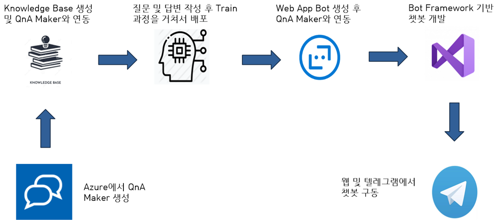

# 프로젝트 소개
---
- **공식 프로젝트명**
    - tmp
- **팀명**
    - tmp
- **제품/서비스명(브랜드)**
    - tmp

# Pain Point, 풀고자 하는 문제
---
- **Pain Point**
    - tmp

- **풀고자 하는 문제**
    - tmp

# 어떻게 푸는가?
---
- **구현내용1**
  - tmp

- **구현내용2**
  - tmp

# (예상)시스템 구성도
---
다음은 빌딩블록을 이용한 시스템 구성도 입니다.
 

# 기대성과
---
- tmp

# Teams
---
- **임호종**
 
    - 역할
- **강우석**
 
    - 역할

# 개발환경
---
- **사용도구**
  - **github** : 구체적 사용 방법
  - **slack** :
  - **Arduino** :
  - **putty** :
- **마일스톤**
    1. *2020-04-06 ~ 2020-04-19*
        - 계획한 일
    2. *2020-04-20 ~ 2020-05-10*
        - 계획한 일
    3. *2020-05-11 ~ 2020-06-07*
        - 계획한 일
    4. *2020-06-08 ~ 2020-06-22*
        - 계획한 일
